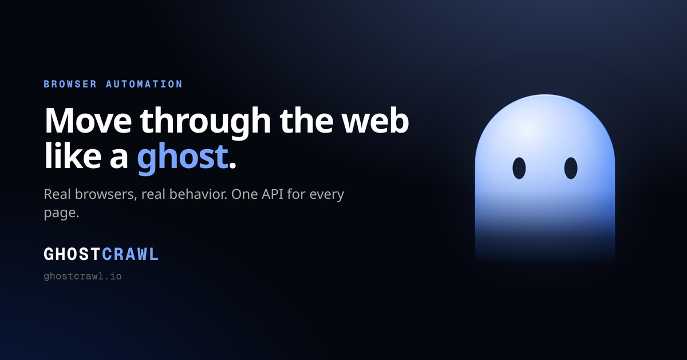
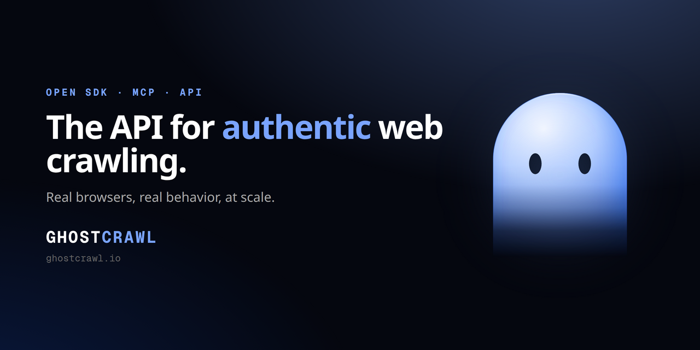

<!-- GitHub social preview image lives at images/github-social.png
     (repo Settings → Options → Social preview). -->

<div align="center">



# GhostCrawl

### Move through the web like a ghost.

Real Chrome, Firefox, and WebKit browsers in the cloud, so your agents and
scrapers get reliable page results without managing a single browser, queue, or exit.

[](LICENSE)
[](https://pypi.org/project/ghostcrawl/)
[](https://www.npmjs.com/package/@ghostcrawl/sdk)
[](https://ghostcrawl.io)
[](https://ghostcrawl.io)
[](#self-host-free)
[](#capabilities)

[Website](https://ghostcrawl.io) ·
[Documentation](https://ghostcrawl.io) ·
[API](https://api.ghostcrawl.io) ·
[MCP](https://mcp.ghostcrawl.io) ·
[Examples](examples/)

</div>

---

## What is GhostCrawl?

GhostCrawl is a web-data API for crawling, scraping, structured extraction, and
full browser automation. You send a URL or a goal; GhostCrawl drives a real
browser, gets through, and returns clean results: HTML, Markdown, screenshots,
or structured JSON.

It works two ways, same API and SDKs for both:

- **Managed cloud:** point a client at `api.ghostcrawl.io` and go. We run the
  browsers, pick the engine, and route every request automatically. Nothing to
  operate.
- **Self-host:** run the container on your own machine, your own IP, your own
  data. Free forever.

GhostCrawl is **MCP-native**: every capability is exposed as a Model Context
Protocol surface, so any agent can drive it directly.

---

## Why GhostCrawl?

- **It gets through.** Pages render and return authentic results where ordinary
  headless setups get blocked or fed altered content.
- **Three real engines.** Chrome, Firefox, and WebKit. Pick one or let
  `auto` choose. The same site looks the same to GhostCrawl as it does to a
  real visitor.
- **Zero browser ops.** No queues, no exits to rotate, no fleet to babysit. On
  cloud, that's all included; routing rotates automatically.
- **One API, every workflow.** Scrape, crawl, extract structured data, control a
  live session, run SERP queries, store results, on one consistent surface.
- **MCP-native.** The full user API is available to agents over MCP out of the box.
- **Typed SDKs.** First-class SDKs for Python, Node/TypeScript, Go, Java, C#/.NET,
  Ruby, and PHP — plus a CLI and a LangChain integration.
- **Run it free.** The self-host image is free; the cloud adds managed routing,
  higher concurrency, and live session view.

---

## Capabilities

| Capability | What it does |
|------------|--------------|
| **Scrape** | Fetch a single page rendered by a real browser → HTML / Markdown / text. |
| **Crawl** | Follow links from a seed URL with depth and page limits; resumable runs. |
| **Extract** | Pull structured JSON from a page against a schema you provide. |
| **Browser control** | Drive a live session: navigate, click, type, scroll, screenshot. |
| **Agent (MCP)** | Give an agent a goal; it navigates and acts to complete it. |
| **Search / SERP** | Query search engines and verticals (web, news, shopping, and more). |
| **Sessions** | Sticky, reusable browser sessions with consistent identity. |
| **Identity profiles** | Persistent, coherent browser identities that survive across runs. |
| **Storage** | Datasets, screenshots, and recordings, managed for you. |
| **Authentic browser fingerprint** | Every session presents a coherent, authentic browser identity. |

---

## Quickstart

### 1. Get an API key

Create an account at [ghostcrawl.io](https://ghostcrawl.io), verify your email,
log in, and mint a key from your dashboard. Keys look like `gck_live_…` and are
sent as a bearer token on every request.

### 2. Call the API

**curl:**

```bash
curl https://api.ghostcrawl.io/v1/scrape \
  -H "Authorization: Bearer $GHOSTCRAWL_API_KEY" \
  -H "Content-Type: application/json" \
  -d '{"url": "https://example.com", "format": "markdown"}'
```

**Python** ([`ghostcrawl`](https://pypi.org/project/ghostcrawl/)):

```bash
pip install ghostcrawl
```

```python
from ghostcrawl import GhostcrawlClient

client = GhostcrawlClient(token="gck_live_YOUR_KEY")
result = client.scrape(url="https://example.com", format="markdown")
print(result)
```

**Node / TypeScript** ([`@ghostcrawl/sdk`](https://www.npmjs.com/package/@ghostcrawl/sdk)):

```bash
npm install @ghostcrawl/sdk
```

```typescript
import { GhostcrawlClient } from '@ghostcrawl/sdk';

const client = new GhostcrawlClient({ token: 'gck_live_YOUR_KEY' });
const result = await client.scrape({ url: 'https://example.com', format: 'markdown' });
console.log(result);
```

**CLI** ([`@ghostcrawl/cli`](https://www.npmjs.com/package/@ghostcrawl/cli)):

```bash
npm install -g @ghostcrawl/cli
ghostcrawl scrape https://example.com --engine chrome
```

**LangChain** ([`ghostcrawl-langchain`](https://pypi.org/project/ghostcrawl-langchain/)):

```bash
pip install ghostcrawl-langchain
```

```python
import os
os.environ["GHOSTCRAWL_API_KEY"] = "YOUR_API_KEY"

from ghostcrawl_langchain import GhostcrawlScrapeTool

tool = GhostcrawlScrapeTool()
print(tool.invoke({"url": "https://example.com"}))
```

Every engine accepts an `engine` of `chrome`, `firefox`, or `webkit`, or `auto`
to let GhostCrawl choose. Runnable versions of every snippet, plus crawl,
extract, agent, and MCP examples, live in [`examples/`](examples/).

---

## Use it from an agent (MCP)

GhostCrawl's full user API is available over MCP. Point any MCP-capable agent at
`mcp.ghostcrawl.io` with your API key:

```json
{
  "mcpServers": {
    "ghostcrawl": {
      "url": "https://mcp.ghostcrawl.io",
      "headers": {
        "Authorization": "Bearer YOUR_API_KEY"
      }
    }
  }
}
```

The MCP surface exposes navigate, act, extract, screenshot, scrape, crawl, and
more, the same managed browsers behind the REST API. See
[`examples/mcp/`](examples/mcp/).

---

## Self-host (free)

Run GhostCrawl on your own machine. Your compute, your IP, your data.

```bash
pip install ghostcrawl        # ships the CLI
ghostcrawl init               # store your API key
ghostcrawl install            # pull + verify the image
ghostcrawl start              # launch locally
ghostcrawl status             # confirm it's healthy
```

A self-hosted instance exposes its own local API, MCP, and dashboard so you can
drive and watch live sessions on your own hardware. The image validates your API
key online each time it starts.

Prefer Compose? See [`docker-compose.yml.template`](docker-compose.yml.template)
and the [self-host guide](docs/usage-selfhost.md).

> Managed exit routing is a cloud-only feature. Self-host requests egress from
> your own machine's network.

---

## Pricing

The self-host image is free forever. Cloud plans are metered in **credits**. A request spends
credits based on how much **data** it pulls and how hard the target is to reach, so cost scales
with the work: light pages on standard targets use the fewest credits, while large or
media-heavy pages and protected (premium) targets use more, all from one balance.
You're only charged for what your jobs actually use, so a month of light crawling stretches much
further than the same run of heavy, protected jobs. Every paid cloud plan routes the hard targets
through our premium network automatically, with nothing to buy and nothing to wire. Top up anytime;
top-ups never expire.

See [ghostcrawl.io](https://ghostcrawl.io) for the full, current pricing.

---

## SDKs

| Language | Package | Install |
|----------|---------|---------|
| Python | [`ghostcrawl`](https://pypi.org/project/ghostcrawl/) | `pip install ghostcrawl` |
| Node / TypeScript | [`@ghostcrawl/sdk`](https://www.npmjs.com/package/@ghostcrawl/sdk) | `npm install @ghostcrawl/sdk` |
| Go | [`ghostcrawl-go`](https://github.com/GhostCrawl/ghostcrawl-go) | `go get github.com/GhostCrawl/ghostcrawl-go/v2` |
| Java | `io.ghostcrawl:ghostcrawl-java` | Maven / Gradle (Maven Central) |
| C# / .NET | [`GhostcrawlApi`](https://www.nuget.org/packages/GhostcrawlApi/) | `dotnet add package GhostcrawlApi` |
| Ruby | [`ghostcrawl`](https://rubygems.org/gems/ghostcrawl) | `gem install ghostcrawl` |
| CLI | [`@ghostcrawl/cli`](https://www.npmjs.com/package/@ghostcrawl/cli) | `npm install -g @ghostcrawl/cli` |
| LangChain | [`ghostcrawl-langchain`](https://pypi.org/project/ghostcrawl-langchain/) | `pip install ghostcrawl-langchain` |
| PHP | [`ghostcrawl/ghostcrawl`](https://packagist.org/packages/ghostcrawl/ghostcrawl) | `composer require ghostcrawl/ghostcrawl` |
| Scrapy | n/a | *Coming soon* |

---

## Documentation

- [Install](docs/install.md): SDKs and the self-host CLI flow.
- [Cloud usage](docs/usage-cloud.md): managed API + MCP, auth, engine selection.
- [Self-host usage](docs/usage-selfhost.md): running the image locally.
- [Bring your own self-host](docs/byo-selfhost.md): run it on your own terms.
- [Examples](examples/): runnable snippets for every SDK, the CLI, curl, and MCP.

Full API reference and interactive examples live at
[ghostcrawl.io](https://ghostcrawl.io).

---

## Contributing & Security

- Contributions to the SDKs, CLI, and docs are welcome. See
  [CONTRIBUTING.md](CONTRIBUTING.md).
- Found a vulnerability? Please report it privately. See
  [SECURITY.md](.github/SECURITY.md).

## Support

Open an issue on this repository, or email
[contact@ghostcrawl.io](mailto:contact@ghostcrawl.io).

## License

The GhostCrawl client toolkit in this repository (the SDKs, the CLI, the example
cookbook, the MCP server, and the docs) is released under the [MIT License](LICENSE),
so you can embed and build on it freely. © GhostCrawl, LLC.

The managed cloud service and the self-host engine image are a separate, commercially
licensed product governed by the [GhostCrawl Terms of Service](https://docs.ghostcrawl.io/legal/terms).
Using the cloud API or running the self-host image requires a valid GhostCrawl account.

---

<div align="center">



**[Get started at ghostcrawl.io →](https://ghostcrawl.io)**

</div>
